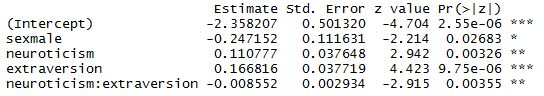

```{r setup, include=FALSE}
# knitr::opts_chunk$set(echo = FALSE)
```

## Workshop Outline

Effect Displays

- Motivate the use of effect displays
- How to calculate effects
- How to create and interpret effect displays in R

Coefficient Plots

## Quick review of linear models

- We have some quantity of interest that varies. Call it the _response_, or _dependent variable_.
- We think the variability of our response can be explained by other variables, often called _independent variables_.
- A linear model says the dependent variable can be explained or approximated by a weighted sum of the independent variables:

$$y = \beta_{0} + \beta_{1}x_{1} + \beta_{2}x_{2} + \dots + \beta_{k}x_{k}$$

- The linear model is approximate and will be "off" by some amount; that amount is typically assumed to be a random draw from some known probability distribution (for example, the Normal dist'n)

## Quick review of linear models

- Our response can be a continuous number, discrete count, binary, categorical, or ordered categorical.
- Each of those responses require different estimation procedures and assumptions, but all can fit into the linear model framework: 

> _a response modeled as a weighted sum of independent variables_.

## Linear model example

Do gender and the personality dimensions, neuroticism and extraversion, explain the probability of volunteering for psychological research? The response is a simple yes or no. Cowles and Davis (1987)   
\     


This requires logistic regression. The authors modeled the response as a function of gender, neuroticism, extraversion and the interaction of neuroticism and extraversion.   
\ 

What to make of this output? How to interpret the interaction?  
\ 




## An effect display of the interaction


## Interpretation

The main effects of `neuroticism` and `extraversion` are lower-order terms marginal to the high-order term `neuroticism*extraversion`.  
\ 

At low levels of `extraversion`, increased `neuroticism` leads to a higher probability of volunteering. But as `extraversion` increases, the relationship between `neuroticism` and volunteering reverses.   
\   

**The effect display allows us to see these high-order terms "in action".**

## The `effects` package

The `effects` package by John Fox allows us to easily create _effect displays_. Typical usage:
\ 

1. Fit a model and save to an object (example: `mod1`)
2. Call `plot(allEffects(mod1))`

This will create one or more effect displays (depending on complexity of your model) using default settings. However there are _many_ arguments that allow us to customize both the effect calculations and the plots.  
\ 

The plots are created using the `lattice` package.


## How effect displays are made

1. Fit a model
2. Pick effect(s) to _focus_ on; called "focal predictors" in the `effects` package
3. Make predictions using model, changing the focal predictor(s) while holding other variables at some constant value
4. Plot the predicted values versus the focal predictor

The `effects` package does steps 3 and 4.


## Supported models

- `lm` (linear model)
- `glm` (generalized linear model)
- `gls` (generalized least squares, `nlme` package)
- `multinom` (multinomial logit model, `nnet` package)
- `polr` (ordered logit model, `MASS` package)
- `lmer` & `glmer` (linear mixed effect models, `lme4` package)
- `lme` (linear mixed effect model, `nlme` package)
- `poLCA` (polytomous latent-class model, `poLCA` package)
- `clm2` & `clmm` (ordinal logistic mixed effects models, `ordinal` package)
- any model object that has a linear predictor and responds to the `coef`, `model.frame`, `formula`, and `vcov` functions

Let's go to R!

## Modifying effect displays

`plot(allEffect(model))` is a great place to start visualizing your model, but we usually want to tweak the display in some way.   
\ 

We can modify the way effects are calculated or the way they're plotted, or both. We can also select which effects to calculate/plot.
\ 

First we'll tackle how to modify effect calculations. To do this, we need to learn a couple of new functions and several arguments.

## The `effect` and `Effect` functions

Somewhat confusingly, there are two functions for calculating specific effects: `effect` and `Effect`.  
\ 

- The `effect` function requires that you specify a model _term_.  
- The `Effect` function requires that you specify _focal predictors_.  

Both return the same thing. In fact, the `effect` function works by constructing a call to `Effect`. According to the documentation, `Effect` will work with some models for which `effect` fails, such as models with nested terms.   
\ 

Probably best to stick with `Effect`.

## term vs. focal predictor

- **term** is an actual term in a model, such as `neuroticism*extraversion`, for which we want to create an effect plot
- **focal predictors** are the predictors in a model for which we want to create an effect plot. For example: `neuroticism` and `extraversion`

Say we have a model called `model` with an interaction `x1*x2`. There are two ways we can calculate effects for the interaction:

1. `effect(term = "x1*x2", model)`
2. `Effect(focal.predictors = c("x1","x2"), model)`

## Effect example

```{r echo=FALSE}
library(effects)
```

```{r echo=TRUE}
cowles.mod <- glm(volunteer ~ sex + neuroticism*extraversion, 
                  data=Cowles, family=binomial)
Effect(focal.predictors = c("neuroticism","extraversion"), 
       mod = cowles.mod)
```

## Effect example with plot
```{r}
plot(Effect(focal.predictors = c("neuroticism","extraversion"), 
       mod = cowles.mod))
```


## Setting values for numeric focal predictors

The `effects` package will automatically generate levels for numeric focal predictors. In our example it set `extraversion` to 5, 10, 15, 20 and `neuroticism` to 0, 5, 10, 15, 20.  
\ 

We can set the levels ourselves using the `xlevels` argument. It can either be an integer or a named list of values. 
\ 

- If `xlevels=n` is an integer, then each numeric predictor is represented by `n` equally spaced levels.
- If `xlevels` is a named list of values, then each numeric predictor is set to the specified values.


Example of a named list:  
`xlevels=list(neuroticism=seq(0,24,2), extraversion=3)`

## `xlevels` example
```{r fig.height=5}
plot(Effect(focal.predictors = c("neuroticism","extraversion"), 
       mod = cowles.mod,
       xlevels = list(neuroticism=seq(0,24,2), 
                      extraversion=3)))
```


## Values for predictors that are NOT focal predictors

Recall that an effect display plots predictions for various values of our focal predictors. But if our model has other predictors, we have to plug in values for them as well.  
\ 

In our volunteer example, we showed predicted probability of volunteering at various levels of `neuroticism` and `extraversion`. Not shown was the `sex` variable, which was set to 0.45.   
\ 

The mean is the default value for numeric predictors that are not focal predictors. For factors, the value is set to the proportion of each level.

## Setting values for predictors that are NOT focal predictors

The `given.values` argument allows us to set values for predictors that are not focal predictors.  
\ 

`given.values` takes a numeric vector of named elements. The names in the vector need to match the names in the model.matrix (ie, the names listed in the model output)   
\ 

Example:   
`given.values = c(sexmale = 1)`      
`given.values = c(sexmale = 1, age = 25, educ = 4)`   
\ 

## `given.values` example 

```{r fig.height=4.8}
e.out <- Effect(focal.predictors = c("neuroticism","extraversion"), 
                mod = cowles.mod, 
                xlevels = list(neuroticism=seq(0,24,2), 
                               extraversion=3),
                given.values = c(sexmale = 1))
plot(e.out)
```

## `Effect` recap

- Include `focal.predictors` as a vector of variable names
- Use `xlevels` to set the values of the focal predictors
- Use `given.value` to set the values of variables that are not focal predictors

Let's go to R!

## Customizing Effect Displays

We can make simple customizations such as change the axis labels or plot title. Or we can make more complex changes such as rescale the axis, combine plots and more.   
\ 

The documentation for the plot method is thorough, and therefore possibly overwhelming if you're new to the package.   
\ 

We'll cover the major arguments that should hopefully give you solid control of customizing the plots. All of the following are arguments for the `effects` package `plot` function.

## Changing scale of vertical axis

The `type` argument allows us to change the scale of the vertical axis (ie, the response or dependent variable).

- `rescale` (default), for generalized linear models plots the vertical axis on the _link_ scale (eg, logit) but labels the axis on the _response_ scale. 
- `link`  plots and labels the vertical axis on the scale of the link (eg, logit)
- `response` plots and labels the vertical axis on the scale of the response (eg, probability)

## Example of `type = "rescale" `


```{r}
plot(e.out, type="rescale")
```

## Example of `type = "link" `

```{r}
plot(e.out, type = "link")

```


## Example of `type = "response" `

```{r}
plot(e.out, type = "response")

```


## Dictating what is plotted on x-axis

The default focal predictor plotted on the x-axis is the predictor with the largest number of levels or values.   
\ 

We can change that using the `x.var` argument. Give it the quoted name of the covariate or factor to place on the horizontal axis of each panel of the effect plot.    
\ 

We can also change the x-axis and y-axis labels using the usual `xlab` and `ylab` arguments.

## Example of `x.var` argument

```{r fig.height=5.5}
plot(e.out, x.var = "extraversion", 
     ylab = "Prob of Volunteering")
```


## Combining plots

Instead of multiple plots, we might want one plot with multiple lines. We can achieve that be setting `multiline = TRUE`.   
\ 

If TRUE, (for linear, generalized linear or mixed models), the display represents combinations of values of two predictors, with one predictor on the horzontal axis, and the other used to define lines in the graph.    
\ 

`multiline = TRUE` is the default if there are no standard errors in the object being plotted.   
\ 

## `multiline = TRUE` example

```{r}
plot(e.out, multiline = TRUE)

```


## Changing colors of lines and line types

When using `multiline = TRUE`, you may not like the default colors or line types. These can be modified with the `colors` and `lines` arguments.   

- `colors`: a vector of colors, or just one color 
- `lines`: a vector of numbers representing line types

Codes for line types in R: 0=blank, 1=solid (default), 2=dashed, 3=dotted, 4=dotdash, 5=longdash, 6=twodash

## Example of changing line color and type

```{r}
plot(e.out, multiline = TRUE, colors = "black", 
     lines = c(2, 5, 1))

```


## Changing look of confidence bands 

To change the look of confidence bounds, use the `ci.style` argument.

- Use `"bands"` when you have a continuous variable on the x-axis. (default)
- Use `"lines"` when you have a continuous variable on the x-axis.
- Use `"bars"` when you have a continuous or categorical variable on the x-axis.

Caution: using confidence bands with multiline plots can make for a crowded plot.

## `ci.style = "lines"` example

```{r}
plot(e.out, ci.style = "lines", color = "black")
```


## `ci.style = "bars"` example

```{r}
plot(e.out, ci.style = "bars")
```


## Changing color and transparency of CI bands

By default, CI bands are grey with a transparency of 0.15. Transparency values ranges from 0 to 1, where 0 is totally transparent (ie, invisible) and 1 is not transparent (ie, solid).   
\ 

To change band color, use the `band.colors` argument. For example, `band.colors = "red"`   
\ 

To change band transparency, use the `band.transparency` argument. For example, `band.transparency = 0.25`

## Example modifying CI bands
```{r}
plot(e.out, band.colors = "red", band.transparency = 0.25)
```


## Changing the color of the strips in the plot

The `setStrip` and `restoreStrip` functions modify the strips that appear in the plots.   
\ 

The default call `setStrip()` provides monochrome (rather than the default colored) strips with up to 3 gray-scale values corresponding to 3 conditioning variables.   
\ 

`restoreStrip` is used to reset the strips to previously saved parameters returned by `setStrip`.   
\ 

## Example of modifying strips
```{r fig.height=4.7}
.save.strip <- setStrip() # change to monochrome
plot(Effect(focal.predictors = 
              c("neuroticism","extraversion", "sex"), 
            cowles.mod))
restoreStrip(.save.strip) # restore previous settings
```


## Changing the axis tick mark labels

By default, the `plot` method will automatically select "pretty" values for the axes. This is usually sufficient. But if we want to customize, we use the `ticks` and `ticks.x` arguments. 

- `ticks`: control placement of tick marks on the vertical axis
- `ticks.x`: control placement of tick marks on the horizontal axis

The `ticks` argument requires a two-item list (`at` and `n`; if `at` is used, `n` is ignored). The `ticks.x` argument requires a named list of lists!   
\ 

Let's look at two examples.

## Example of `ticks` argument
```{r fig.height=5}
plot(e.out, ticks = 
       list(at=c(.1,.25,.5,.75)))

```

## Example of `ticks.x` argument
```{r fig.height=5}
plot(e.out, ticks.x = list(neuroticism = 
                      list(at=seq(0,24,2))))

```

## Get rid of the rug, add the grid

The black lines on the x-axis represent observations. This is called the _rug_. This can help us see how our observations are distributed with respect to the predictor on the x-axis.    
\ 

If we have many observations that are uniformly distributed, there is no need for a rug.   
\ 

To turn off, set `rug = FALSE`. (default is `TRUE`)  
\ 

We can also add grid lines by specifying `grid = TRUE`. (default is `FALSE`) Beware the grid lines may not match up to the axis tick marks.


## Example of `rug = FALSE` and `grid = TRUE`

```{r fig.height=5}
plot(e.out, rug = FALSE, grid = TRUE)

```


## There are many more `plot` arguments

We covered the main arguments, but there are many others, most of which are specific to the `lattice` package.    
\ 

The documentation for the `effects` package `plot` method also has many good examples demonstrating various ways you can customize your plot.  
\ 

`?plot.eff`  
\ 

Let's go to R!


## Creating effect displays with `ggplot2`

The effects package includes `as.data.frame` methods that lets you save an effects object "as a data frame".   
\ 

This facilitates the creation of custom displays, particularly for the `ggplot2` package.   
\ 

Typical usage is something like this:   
```{r eval=FALSE}
e.out <- Effect(c("x1","x2"), model)
DF <- as.data.frame(e.out)

```


This creates a data frame with columns for the focal predictors, the fit, and the upper and lower bounds. 

## Structure of the `as.data.frame` result

```{r}
eDF <- as.data.frame(e.out)
# display column names of eDF
names(eDF)
# first 3 rows
head(eDF, n = 3)
```


## Example `ggplot2` code

```{r eval=FALSE}
library(ggplot2)
ggplot(eDF, aes(y=fit, x=neuroticism)) + 
  geom_ribbon(aes(ymin = lower, ymax = upper), 
              fill = "grey70") + 
  scale_y_continuous(trans = "logit") +
  geom_line() +
  facet_wrap(~extraversion, labeller = label_both) +
  labs(title = "neuroticism:extraversion effect display",
          y = "P(volunteer)")

```

## Example `ggplot2` effect display

```{r echo=FALSE, fig.height = 5}
eDF <- as.data.frame(e.out)
library(ggplot2)
ggplot(eDF, aes(y=fit, x=neuroticism)) + 
  geom_ribbon(aes(ymin = lower, ymax = upper), fill = "grey70") + 
  scale_y_continuous(trans = "logit") +
  geom_line() +
  facet_wrap(~extraversion, labeller = label_both) +
  labs(title = "neuroticism:extraversion effect display",
          y = "P(volunteer)")

```


## Using the `visreg` package

- The `visreg` package, Visualization of Regression Models, can create effect displays using `ggplot2`

- Set `gg = TRUE`

- only works for multipanel plots.

- By default it uses `lattice` like the `effects` package.

- The `visreg` package is easier and friendlier to use than `effects` but not as customizable.


## `visreg` example (default)

```{r fig.height=5}
library(visreg)
visreg(cowles.mod, xvar = "neuroticism", 
       by = "extraversion",  
       scale = "response", partial = FALSE)

```

## `visreg` example (`ggplot2`)

```{r fig.height=5}
library(visreg)
visreg(cowles.mod, xvar = "neuroticism", 
       by = "extraversion",  
       scale = "response", partial = FALSE, gg = TRUE)

```


## Coefficient Plots

Another way to visualize linear model results is with coefficient plots.   
\ 

A coefficient plot is a dot plot of coefficients appearing in linear model output with standard error bars.   
\ 

The resulting plot allows you to visually compare coefficient sizes and see how precisely they have been estimated.  
\ 

## Example of Coefficient Table

```{r echo=FALSE }
round(summary(cowles.mod)$coefficients[,1:2],3)
```

## Coefficient Table presented as a coefficient plot

```{r echo=FALSE}
library(coefplot)
coefplot(cowles.mod, intercept = FALSE)
```


## About the coefficient plot

- Vertical line for 0 allows us to see how close or far coefficients are from 0, and hence compare relative importance of predictors
- The standard error bars allows us to easily see the uncertainty in our estimate
- Common practice to drop Intercept if it lacks easy interpretation or is so large (far from 0) that it makes it difficult to judge the distance of other coefficients from 0


## Producing a coefficient plot in R

The `coefplot` package by Jared Lander creates coefficient plots using `ggplot2`.   
\ 

According to documentation, currently only works for `lm` and `glm` objects.   
\ 

Basic usage is to call `coefplot()` on a fitted model. For example, the previous coefficient plot was created with the following:   
\ 

```{r eval=FALSE}
library(coefplot)
coefplot(cowles.mod, intercept = FALSE)
```

\ 

## Multiple coefficient plots

We can also create multiple coefficient plots in one graph using `multiplot`.   
\ 

You can either plot all coefficients from all models in the same graph, or create separate coefficient plots for each model for side-by-side comparison.    

- `multiplot(mod)` shows all models in one plot; can get crowded with more than 3 models
- `multiplot(mod, single = FALSE)` creates separate coefficient plots for each model; can also get crowded with more than 3 models


Let's go to R!


## References

- Cowles, M. and C. Davis (1987) The subject matter of psychology: Volunteers. _British Journal of Social Psychology_ 26, 97-102.

- Fox, J. (2003) Effect displays in R for generalised linear models. _Journal of Statistical Software_ 8:15, 1-27, <http://www.jstatsoft.org/v08/i15/>.

- Fox, J. and J. Hong (2009). Effect displays in R for multinomial and proportional-odds logit models: Extensions to the effects package. _Journal of Statistical Software_ 32:1, 1-24, <http://www.jstatsoft.org/v32/i01/>.


## Thanks for coming today!

For help and advice with your statistical analysis: statlab@virginia.edu   
\ 

Sign up for more workshops or see past workshops:   
http://data.library.virginia.edu/training/  
\ 

Register for the Research Data Services newsletter to stay up-to-date on RDS 
events and resources: http://data.library.virginia.edu/newsletters/   